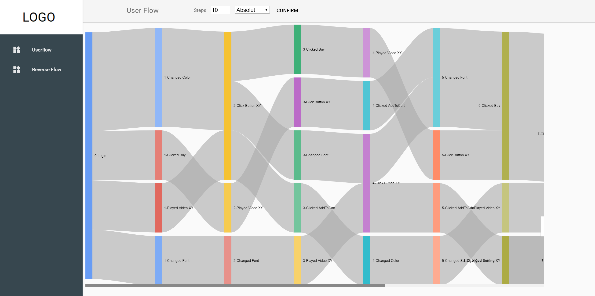
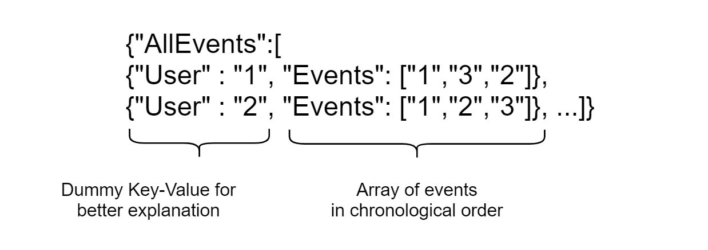
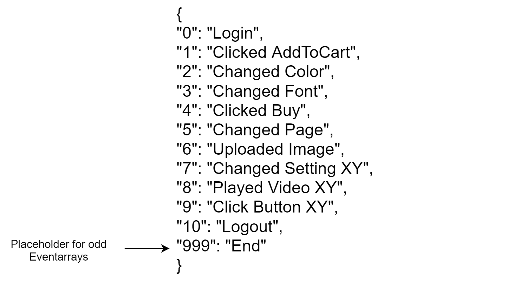

# EventFlowChart
Webpage for displaying Events with the Google Charts Sankey Diagramm out of a JSON File.

 Two frameworks are used to display the events:
 Google MDL Template: https://getmdl.io/templates/index.html
 Google Charts Sankey Diagramm: https://developers.google.com/chart/interactive/docs/gallery/sankey

 

# Data

For displaying the Events we need two JSON-Files inside the "data" folder.
 In one JSON-File we are holding the events:

 

In the over JSON-File we can map the numbers to real Events:

 

# Computation

The events will be loaded into Javascript and converted into weight network JSON-Objects for every Steplayer:
  
{"Events": ["1","2","4"]},{"Events":["1","2","3"]} 
  
for example will be converted into: 
{
  1:[{"from":1, "to":2,"weight":2}],
  2:[{"from":2, "to":4,"weight":1},{"from":2, "to":3,"weight":1}]}
